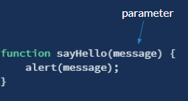

# Nav Bar - adding active class when clicked

### Setting up a New Project

For this exercise, you need to download the set of starter files that you will use in your Visual Studio Code project.

#### 1.Click on the link below to go to the GitHub repository where the files are stored.



#### 2. Download the ZIP containing the starter files.


#### 3. Store the Zip file in your projects folder.

The file name will default to article-grid-jscript-main.zip.

#### 4. Unzip the zip file.

Use WinZip or [7Zip](https://www.7-zip.org/download.html) to extract the contents. Choose the "Extract Here" to extract the directory.

### Starting HTML

Our initial page looks like this. We have the header and the footer from our previous article grid project.

The purpose of this lesson is to add some interactivity to the page by changing the Main Content area based on which navigation link has been clicked.


### Responding to Events

Once a web page is loaded, it is just waiting until the user interacts with it. For example, a user can click a button, move his mouse, push a key on his keyboard, or resize the window. 

The web browser is detecting all of these events and you can tell the web browser that it is interested in being notified when a particular type of event occurs on a particular element on the page.  This process is known as registering for an event handler. 

An event handler is a block of code, typically a JavaScript function that the web developer writes, that will be run when the event fires.

### Registering an Event Handler

Elements that can respond to events have attributes that allow you to assign JavaScript code that will be called when the event occurs.

For example,  we can assign JavaScript code to be executed when the onclick event occurs when the user clicks on the anchor element in the navigation bar.

This code is called an "event handler".

 Our event handler for the onclick event calls the alert method, which will bring up a dialog window displaying the message you provide.


```javascript
<ul>
    <li><a onclick="window.alert('clicked tech')" href="">Tech</a></li>
    <li><a href="">Science</a></li>
    <li><a href="">Food</a></li>
    <li><a href="">Arts</a></li>
    <li><a href="">Sports</a></li>
    <li><a href="">Account</a></li>
</ul>
```

### JavaScript Statement

The code in our event handler is a JavaScript statement. A statement is an instruction that performs an action.  

```javascript
window.alert('clicked tech');
```

This statement is calling a built-in method on the window object, which is provided by the JavaScript runtime environment.



### window object

Computer programs can represent real world objects. The window object is provided by the JavaScript runtime environment. It represents the browser window. An object contains properties/attributes and methods/functions that your JavaScript code can access to find out information about the browser window and the HTML document that is currently loaded within it.

Open the Chrome Developer Tools and go to the Console tab. There will be a "&gt;" symbol. This is the programmatic interface to the JavaScript Engine within the Chrome browser.

Type in the word window and enter. Expand the window object that is displayed. You will see the following. This is a view of what the window object looks like. It has methods \(actions\) and properties \(another name for attributes\). JavaScript code can call methods and get/set property values on the window object.

#### window methods - window.alert, window.confirm


#### window properties - window.location, window.height, window.width

the window property window.location provides information about the current page, such as it's host, href, protocol.

the window.innerHeight and window.innerWidth properties give the current height and width of the visible window. At the bottom of the screen capture you can see that the window.innerHeight has different values. I was changing the size of the Developer Tools window so that the visible browser window for the HTML document was changing size.


#### Calling window.alert in the Console

Copy the statement and place it in the console window and Enter. The statement will be immediately executed by the JavaScript Engine.

The statement is calling the alert method on the window object and passing it a string as a parameter to the method. The following is the general format of a method call. The object name is followed by a dot and then the name of the method. Then the arguments are contained within opening and closing parentheses. 

The parentheses are required, even if there are no parameters to the method.


Notice that the message you pass the the alert method needs to be in quotes. String is JavaScript can be surrounded by either single or double quotes. But you must use one or the other for a single string.

```javascript
window.alert("Hello');  // not ok
window.alert("Hello");  // ok
window.alert('Hello');  // ok
```

#### window methods and properties are global

 All methods and properties of the global window object can be accessed directly, without having to preceded it with the window. 

The following two statements are equivalent. So from now on I will use the shorter option.

```javascript
window.alert("Hello");

alert("Hello");
```

Change the tech-link anchor to use the short-hand alert.

```javascript
<li><a onclick="alert('clicked tech')" href="">Tech</a></li>
```

### 

### Strings in JavaScript

In the code below, you can see that there are both single and double-quotes in the value for the onclick attribute. In general, in JavaScript code, both are acceptable when creating a string. But, when a situation arises when you need quotes within your string, you have two choices.

#### Use alternate quotes for embedded string.

```javascript
onclick="alert('clicked tech')"
```

#### Escape the embedded quote

```javascript
onclick="alert(\"clicked tech\")"
```

Type the following in the Console. The statement on line 5 will cause an error due to embedded quotes.

```javascript
alert("hello")

alert('hello')

alert("i said "hello" ")

alert("i said \"hello\" ")
```

### Multiple statements

Add another statement following the first one.

```javascript
<li><a onclick="alert('clicked tech'); alert('about to change sections');" href="">Tech</a></li>
```

While JavaScript does not require a semi-colon at the end of a statement, and allows multiple statements to be on a single line, it is best practice to follow these rules:

* write each statement on a single line
* end each statement with a semi-colon

```javascript
alert('clicked tech'); 
alert('about to change sections');
```

In our event handler, we are embedding the JavaScript code within the onclick attribute value. This is not the recommended way to write event handlers. As you can see, the code is getting difficult to maintain.

### Script elements

One alternative is to move the JavaScript code to a script element.

It is legal for a script element to be placed anywhere in the document.

The &lt;script&gt; element causes the web browser to stop processing the HTML and process the script element before continuing to process the HTML document.

Add the script element, and remove the onclick handler on the anchor element and refresh your web page.

You can see that the statements in the script element are immediately executed when the page loads. 

```javascript
<nav class="nav-container">
  <a href="index.html">
    
  </a>
  <script>
      alert('tech-link clicked'); 
      alert('about to change sections');
  </script>
  <ul>
    <li><a href="">Tech</a></li>
    <li><a href="">Science</a></li>
    <li><a href="">Food</a></li>
    <li><a href="">Arts</a></li>
    <li><a href="">Sports</a></li>
    <li><a href="">Account</a></li>
  </ul>
</nav>
```

### Global Statements vs Functions

The statements above are global statements, meaning that they are at the top-level of the script and as the file is processed, they will be executed immediately. 

In contrast to global statements, the vast majority of statements will be organized into reusable units of code that can be executed at a later time in response to events, such as a user clicking a button. These separate blocks of code are known as functions. 

A function is just a reusable chunk of code that does something.  Functions help organize our code and make it easier understand. You can create your own functions and use functions created by team members or third-party libraries. The JavaScript runtime environment also supplies a large number of built-in functions.

The alert function is an example of a function \(called a method when it is attached to an object\) provided by the JavaScript runtime environment. Its purpose is to display a text message on the screen. There's a lot going on inside the alert function, but we don't need to worry about that. We can just call the function and expect that it will do what the documentation says it will do. 

For our event handler, we can declare a function to respond to the event that contains the two statements that we want to execute when the function gets called.

```javascript
<script>

    function respondToClick() {
      alert('tech-link clicked'); 
      alert('about to change sections');
    }
    
</script>
```

### Function Declarations


First, the function keyword is what lets us know that we will be creating a function. The function's name comes next. You can name a function whatever you want, as long as you avoid the special keywords reserved for the language and some other special-cases, such as not starting the name with a number. As long as you try to name your functions with something that makes sense for the action it will be performing, you usually don't run into problems. 

Following the name is a pair of opening and closing parenthesis. These are where you will define any data that your function requires to perform its task. We're going to defer the discussion of passing in data until after we've worked with the simple function that doesn't require any data.

Last is the opening and closing pair of curly braces. These braces surround the statements, or instructions, that the JavaScript engine needs to execute for the function to complete its overall objective. In the simple function above, there is only a single instruction to call the alert function provided by the JavaScript runtime environment.

### Practice with Functions StackBlitz



StackBlitz is a cloud-based coding environment that's great for quick tests and we'll use it hear to try out a few things with functions.

Try creating a function called saySomething, that takes a single parameter and sends that value to the alert method.

### Calling Functions

Currently, we just have a function declaration in our script element. When the web browser processes the web page, it will encounter the script element and pass the code to the JavaScript Engine to interpret. 

When the code is processed, it will see the function, and store it away until it encounters a statement that invokes the function.

Refresh your web page and confirm that the alert messages are no longer displayed.

Now, change the onclick attribute on the anchor to call the function in our script block. Refresh the web page and confirm that the function is being invoked.

```javascript
<script>
    function respondToClick() {
      alert('tech-link clicked'); 
      alert('about to change sections');
    }
</script>
<ul>
    <li><a onclick="respondToClick()" href="">Tech</a></li>
    <li><a href="">Science</a></li>
    <li><a href="">Food</a></li>
    <li><a href="">Arts</a></li>
    <li><a href="">Sports</a></li>
    <li><a href="">Account</a></li>
 </ul>
```

### Function Parameters

As we saw with the JavaScript alert function, functions can accept data, called parameters. 

When declaring a function, the parameters are specified as a comma-separated list of parameter names. In the sayHello function below,  we are specifying that the function accepts a single parameter named message. The value of the parameter can then be used in the statements within the function.



### Event Target

When an event handler is called, some information about the event is passed to the event handler function. If we choose to, we can receive that information as a parameter to our function.

In the code, add an event parameter to the onclick attribute value.

```javascript
<li><a onclick="respondToClick(event)" href="">Tech</a></li>

```

Add a parameter to the function declaration, and add one more statement to the beginning of the function that displays the id by retrieving it from the event parameter.

```javascript
 function respondToClick(event) {
      alert(event.target.id);
      alert('tech-link clicked'); 
      alert('about to change sections');
    }
```

The alert function will show an empty string for the id. That's because the anchor element does not currently have an id attribute. So let's add one.

```css
<li><a id="tech-link" onclick="respondToClick(event)" href="">Tech</a></li>
```

Now the alert function will display "tech-link" for the event.target.id.

```javascript
<script>
    function respondToClick(event) {
      alert(event.target.id);
      alert('tech-link clicked'); 
      alert('about to change sections');
    }
</script>
<ul>
    <li><a id="tech-link" onclick="respondToClick(event)" href="">Tech</a></li>
    <li><a href="">Science</a></li>
    <li><a href="">Food</a></li>
    <li><a href="">Arts</a></li>
    <li><a href="">Sports</a></li>
    <li><a href="">Account</a></li>
 </ul>
```

### document object

The window object has a property, window.document, that provides access to the live HTML document, or DOM. Using JavaScript, you can navigate the DOM tree and get/set properties on elements in the tree, as well as adding/removing sections of the tree.

Because the document object is a property of the window object, you can access it directly, without prefixing it with the window.

```javascript
>window.document

>document
```

Within the Chrome Developer Tools Console, type in document and expand the object returned. This is the same as what is displayed in the Elements tab. It is the current representation of the HTML document.

#### document.getElementById

This method allows your code to retrieve a specific element within the HTML document. We are going to use it to retrieve the anchor element that was clicked. 

### Functions with Return Values

Sometimes a method/function just executes a series of statements and completes. This is how the window.alert method works.

Other times a function's job is to perform a calculation or retrieve a value and return it to the caller. This is the case for the document.getElementById method. It will return the HTML element in the DOM that has the id attribute value passed in as a parameter.



### Storing values

We need a way to store the value returned from the  document.getElementById method. 

When we need to store data in a script we use variables. A variable is a “named storage” for data. 

To create a variable in JavaScript, use the **let keyword**. It sets aside a location for the value returned by the function.

```javascript
function respondToClick(event) {
      let targetElement = document.getElementById(event.target.id);
      alert('tech-link clicked'); 
      alert('about to change sections');
}
```

#### An easier way to get the target element

On line 2 in the code above we are calling the document.getElementById method to get the object that represents the anchor HTML element that was clicked. This was just to demonstrate how that method works and how to use a variable to store the return value of a method.

Take a closer look at what is being passed as the argument to document.getElementById. It is the event.target.id. event.target is the object we're looking for.  The code just got the id of the target element and passed that document.getElementById to get the same object as event.target.

```javascript
function respondToClick(event) {
      // let targetElement = document.getElementById(event.target.id);
      let targetElement = event.target;
      alert('tech-link clicked'); 
      alert('about to change sections');
}
```

Let's clean up the code and get rid of the two alert calls.

```markup
function respondToClick(event) {
      let targetElement = event.target;
}
```

### Preventing Anchors From Refreshing the Entire Page

By default, the behavior when you click an anchor, is for the web browser to navigate to a new page with the URL specified in the anchor's href attribute. In our case, it means that the page will be refreshed every time we click one of the navigation links.

When an anchor element is being used like a button, to just respond to an event handler, and we don't want the browser to navigate anywhere, it is necessary to tell the web browser that you don't want the default behavior and your event handler will be entirely responsible for what happens when the anchor is clicked. 

The way you do this is to call the event.preventDefault method.

```javascript
function respondToClick(event) {
  // prevents page from refreshing when the anchor is clicked
  event.preventDefault();
  
  let targetElement = event.target;
}
```

### DOM - modifying element properties

Now that we have the anchor element, we'll add a class to it so that when the anchor is clicked, we can change the color of the link to red to indicate that it is the active section.

To understand what we are trying to accomplish, let's first do it manually.

Add the class="active" to the first anchor.

```css
 <ul>
  <li><a class="active" onclick="respondToClick(event)" href="">Tech</a></li>
  <li><a href="">Science</a></li>
  <li><a href="">Food</a></li>
  <li><a href="">Arts</a></li>
  <li><a href="">Sports</a></li>
  <li><a href="">Account</a></li>
</ul>
```

And add the following selector in your CSS file.

```css
.nav-container a.active {
  color: var(--primary-color);
}
```

This caused the anchor color to change to red.


We want to perform these same steps programmatically by using the DOM API.

We can leave in the new style, but remove the class from the anchor element.

#### Adding a classList property

Once your code has retrieved a specific element from the DOM, in this case the anchor element, we can access methods/properties of the object. 

In this case we're going to access the classList property, which is a list of all of the values for the class attribute on the anchor element, and add a new value.

We can tell if our function is working correctly by the change in color.

```javascript
function respondToClick(event) {
  // prevents page from refreshing when the anchor is clicked
  event.preventDefault();
  
  let targetElement = event.target;
  targetElement.classList.add("active");
}
```

Refresh the page, with the Elements tab open in the Chrome Developer Tools and see how the class attribute on the anchor element is added when we click the Tech anchor.

### Adding Handlers For All Links

```javascript
 <ul>
   <li><a id="tech-link"    onclick="respondToClick(event)" href="">Tech</a></li>
   <li><a id="science-link" onclick="respondToClick(event)"href="">Science</a></li>
   <li><a id="food-link"    onclick="respondToClick(event)" href="">Food</a></li>
   <li><a id="arts-link"    onclick="respondToClick(event)" href="">Arts</a></li>
   <li><a id="sports-link"  onclick="respondToClick(event)"  href="">Sports</a></li>
   <li><a href="">Account</a></li>
</ul>
```

Now, when you click on any of the navigation links, it will add the class value of active to the element, which will cause the style .nav-container a.active to be applied and the anchor link color will be changed to red.

### Moving JavaScript to an External File

While it's easy to work with JavaScript embedded directly in the HTML file, it isn't a good practice. Just like it is better to keep your CSS in external files, it is best to keep your JavaScript code in external files.

### &lt;script&gt; element with external JavaScript code

You can do this by specifying the location of the file with the src attribute. 

```javascript
/* script.js */

function respondToClick(event) {
  // prevents page from refreshing when the anchor is clicked
  event.preventDefault();
  
  let targetElement = event.target;
  targetElement.classList.add("active");
}
```

```markup
<html lang="en">
<head>
</head>
<body>
  <!-- all other html first -->
  <script src="script.js"></script>
</body>
</html>

```

### Script Placement

The &lt;script&gt; element causes the web browser to stop processing the HTML and process the script element before continuing to process the HTML document.

It is legal for a script element to be placed anywhere in the document, including the head element.  In our first example, we just inserted it prior to the ul element where the anchor was. 

But a script could run into a problem if it is located in the document before an element that the script references.

For example, if a script element is inside the head element, and it set the background color of the body element, an error would occur because the body element has not been generated yet.

For that reason, it is best practice to position any script elements at the very end of the body element.

```markup
<html>
    <head>
        <script>
            body.bgColor = "red";
        </script>
    </head>
    <body>
    </body>
</html>
```


