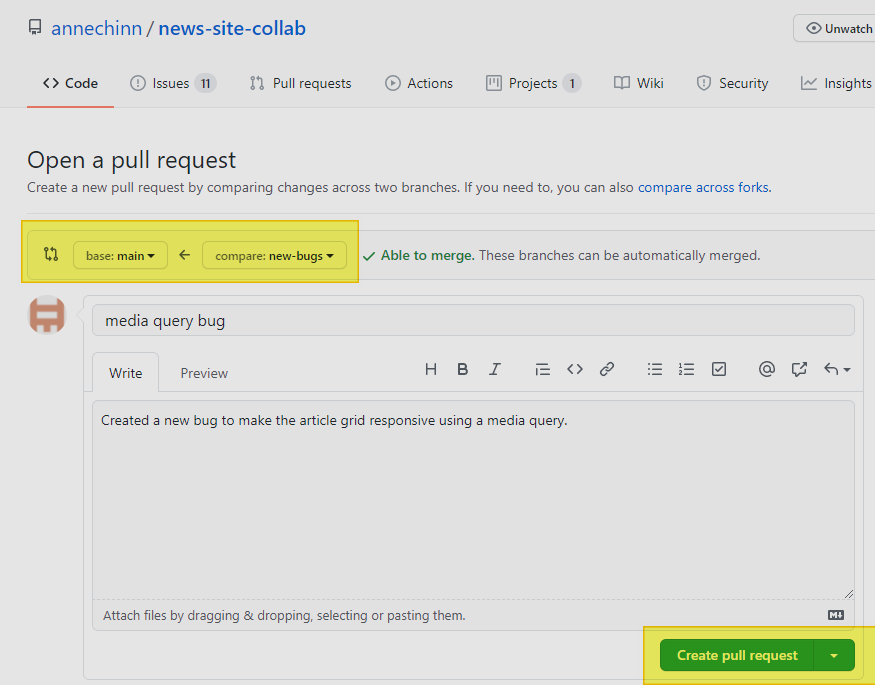

# Week 8 - Saturday, June 5th

### Saturday, June 5th

### Class Video



### Git Cheat Sheet



### Sharing a Repository with a Team

We started working with a shared repository stored under my GitHub account.



To collaborate on the project, you need to clone the repository so that you have a local repository linked to the GitHub repository.

### Clone repository

Follow the steps below:

**Step 1** - Copy the GitHub URL for the repository you want to clone.


**Step 2** - From VS Code, start a new instance of VS Code and click the Clone Git Repository


**Step 3** - Enter the GitHub URL in the box


Now you have a local repository that is linked to the GitHub repository. You don't need to do any of those steps you did previously when you added your local repository to a new GitHub account, such as "git add remote \[GitHub URL\]". The association of your local repository with the GitHub repository you cloned is set up automatically as part of the clone command.

### Working in a Separate Branch

When you are working in a collaborative environment, you need to isolate your work from your teammates' as well as from the main branch that is always supposed to be "production ready".  New code is typically done in a separate "feature branch" and then merged back into the main branch when it finished, tested, and approved. 

The approval process is optional, and setup by the GitHub repository managers. If approval is required, then you must create a "pull request" to initiate the review/merge process into the main branch.

Here are the relevant git commands for working in a feature branch.

#### Get a list of current branches and which is the active branch you are on.

```bash
git branch
```

#### Create a new branch, and switch to new branch

git checkout switches branches, the -b option creates a new branch and then switches

git switch \[branch-name\] or git checkout \[branch-name\] change change branches

```bash
 git checkout -b [branch-name]
```

#### Add and commit your changes to your local branch

You can do this as many times as you want as you work in your local branch. It just allows you to save a snapshot at a particular point in time that you can potentially look at or even revert to at a later time.

```bash
git add .
git commit -m""
```

#### Push your new branch to GitHub

If you have been working for a long time, and just want to make sure your changes are backed-up on GitHub you can do a push. Or, you can wait until you are at a point where you are ready to merge your changes into the main branch. 

In either case, when you want to push your local branch to GitHub the first time, you need to add the extra parameters to the git push command.

```bash
git push --set-upstream origin [branch-name]
```

#### Create a Pull-Request to merge the changes into the main branch.

In GitHub, click on the Pull-Request tab and see the screen that shows the differences between the main branch and your branch. Make sure you have the two branches selected, then click the "Create pull request" button.



Now you have submitted the pull request and I will approve it to be merged into the main branch.

The next two steps should be done when you are no longer going to do any work in the feature branch. In this case it should be deleted from both the GitHub repository and your  local repository.

If, on the other hand, you are going to do further work in the branch, then you don't need to delete it. You can just continue to work in it and push those changes to GitHub when you are ready to do another Pull Request to merge in your next set of changes to the GitHub main branch.

#### Delete GitHub branch after merged

Once I have approved the pull request, then the pull request screen will show it is done and the branch can be deleted. Click the "Delete branch" button to delete your branch.

#### Delete local repository branch

Now you will see that the branch has been deleted. You can now delete the branch on your local computer as well using the following command.

```bash
// make sure you are not in the branch you want to delete
git checkout main

git branch -D [branch-name]
```

### Homework

For this exercise, you're going to work in the news-site-collab repository. I want you to create a new branch for each of the three functions you need to write. So the steps are:

* create a new branch
* add the code for the function
* make sure it passes the tests
* add and commit changes
* push the branch to GitHub
* within GitHub 
  * create a pull request to merge the changes into the main branch
  * go into the pull request and merge the changes.
  * delete the branch in GitHub
* delete the branch on your local computer


We discussed in class how you can push your changes after each function is done and create the pull request and then continue in the same branch if you want.

But, you can also delete the branch in GitHub and your local copy  after each pull request is approved and start again to practice the process.


This is how the console output looks before your first edits.


This is how it will look after both of your branches are complete.


Use the Chrome Developer Tools, including setting breakpoints, to figure out why your functions aren't passing.

#### Try fixing a few Issues

Go to the Issues section or the Projects section.


Browser through the bugs and select one that is not currently assigned and assign it to yourself.


Go through the feature branch process to fix the issue and push it through the pull request process to merge it into the main branch.

### VS Code Issue/Pull Request Extension

There's a very helpful VS Code Extension that helps you manage the process of starting a new branch for an issue. I'd like to walk through this during Wednesday's class. Here's an article, with a good video, that overviews how it works. It goes a little too fast to follow everything in the video, but if you get it you could try installing the extension and assigning yourself one of the issues from within VS Code. It's really quite streamlined to do it all from within VS Code.







### 

### 


