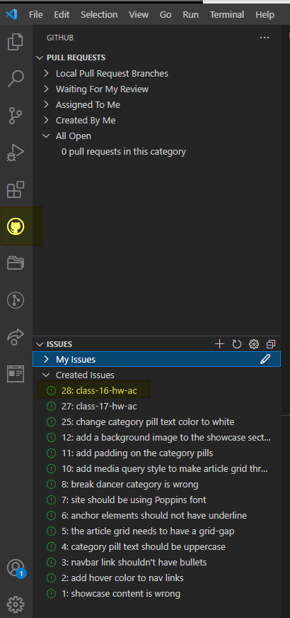
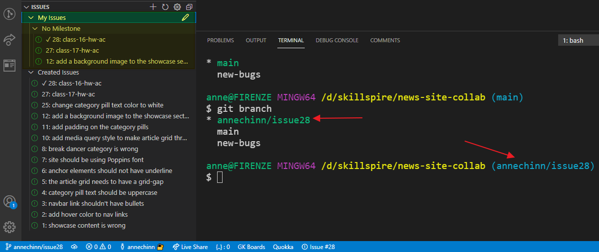

# Week 8 - Wednesday, June 9th

### Wednesday, June 9th

### Class Video




### Git Branch Practice

You're going to work on the GitHub issue assigned for today's homework in a separate branch.  In the last class we learned how to create a new branch from the command line.

```bash
git checkout -b [branch-name]
```

And once we were done with our edits, we did the following

```markup
git add .
git commit -m"checkin message"
git push --set-upstream origin [branch-name]
```

Then, you went into GitHub and created a Pull Request. Once the Pull Request was approved, then you could delete the branch from GitHub and then delete the local branch.

```markup
// make sure you are not in [branch-name] branch
git checkout main

// delete [branch-name] branch
get branch -D [branch-name]
```

There is a VS Code Extension,  **Pull Requests and Issues Extension,** that you can use to perform some of these task within VS Code.

#### Load the Git Pull Request and Issues extension



Once it's installed, there will be a new icon on the left navigation bar to access GitHub integrations. Click on it and there will be a section for Pull Requests and the top and a section for Issues at the bottom.



#### Practice Issue Workflow

First, I'm going to go through all of the steps necessary to start working on a new issue in a branch and push it through to a pull request. This is the process you will use to do your homework, but you will complete the source code changes for the homework before pushing the branch and creating the pull request.

#### Do a pull before creating a new branch

You always want to make sure your main branch is up to date with any changes before you create a new branch because the new branch will use the main branch as its starting point for what files to include.

#### Start Working on the Issue

The first step is to select the issue and right click on it to bring up the context menu. I can't show a picture of it because it disappears when I try to do a screen capture. The context menu should have an option called "Start Working on Issue". Click that option.

VS Code automatically created a new branch and in the terminal window, when I ran the "git branch" command, after starting the issue, it automatically switched me to the new branch.

The new branch is named "annechinn/issue28". \(GitHub username/Issue number\)



#### Add/Commit Changes

I'm going to just go through the steps to setup the starter code for the lab  then add and commit the changes.


Next, I'll push the branch to the GitHub repo.


#### Creating a Pull Request

From the GitHub integration view, right click on the issue and select "Create Pull Request". The following window will come up.


When it first comes up, it isn't showing enough vertically, so I had to drag the divider bar down before I could see the "Create" button at the bottom.



Click the "Create" button.

The follow screen displays the Pull Request. For me, since I'm the admin for the GitHub repo, I have a button to "Merge Pull Request". For you, you would see the same screen, but it would just say that your pull request requires review before it is complete. 

I'll click the "Merge Pull Request" button. It asks me to delete the branch, which I said yes, and then it prompted me with checkboxes to optionally delete the local and/or the GitHub branches. I said yes to both.


Now, when I do a git status in the terminal window it switches back to the main branch and the issue branch has been deleted.


So, that's the overall workflow. It allows you to create the new issue branch and the pull request, without having to leave VS Code.

Once you have worked on the issue, the issue context will show a "Continue Working on Issue" option instead of "Start Working on Issue". Clicking the continue option will again create a new issue branch with the same name, so you can go through the same steps again.

### Algorithm Practice

```javascript
// the function should return a new array that contains
// the string "even", "odd" for each corresponding
// element in the input array based on whether the number
// is even or odd

// use the % operator in the expression to determine
// whether the number is even or odd
// https://developer.mozilla.org/en-US/docs/Web/JavaScript/Reference/Operators/Remainder
```

```javascript
 // using Array.forEach
 
 function evenOrOdd(numbers) {

    let result = [];

    numbers.forEach(x=>{
      if (x%2===0) result.push("even");
      else result.push("odd");
    });

    return result;
   
  }
```

```javascript
// using map

function evenOrOdd(numbers) {

  return numbers.map(x=>{
    if (x%2===0) return "even";
    else return "odd";
  });
 
}
```

```javascript
// using ternary expression

function evenOrOdd(numbers) {
  return numbers.map(x=>x%2===0?"even":"odd");
}
```



#### 

### Working with Array methods find, map, filter

```javascript
// Array.find returns the first element in the list
// that returns true, or undefined if none return true

// find the object in the animals array that has the 
// name==='Faustino'
let animal = zoo.animals.find(x=>x.name==='Faustino');
console.log(animal);

// find the element in the animalTypes array that has the
// name 'lion' and get the id property value from it.
let lionTypeId = zoo.animalTypes.find(x=>x.name==='lion').id;

// Array.filter returns a new array containing only those
// elements that return true

// get an array of objects that have the property "typeId===1"
let lions = zoo.animals.filter(x=>x.typeId===lionTypeId);
console.log(lions);


// Array.map returns a new array that contains the
// same number of elements, but each element in the
// output array is what is returned from the map function.

// get an array that contains each of the lion names.
let lionNames = lions.map(x=>x.name);
console.log(lionNames);
```

### Adding Event Listeners

```javascript
// get the DOM element for the button with id='lion-link'
let button = document.getElementById("lion-link");

// register a function to be called with the button is clicked
button.addEventListener("click", ()=> {

  // find the element in the animalTypes array that has the
  // name 'lion' and get the id property value from it.
  let lionTypeId = zoo.animalTypes.find(x=>x.name==='lion').id;

  // get all of the animal objects that are lions
  let lions = zoo.animals.filter(x=>x.typeId===lionTypeId);
  
  // get an array of all of the lion names
  let lionNames = lions.map(x=>x.name);
  console.log(lionNames);
});
```


### Lab - Working with data to update HTML

#### Exercise Outcome

The goal of this exercise is to learn to create event handlers and dynamically update the HTML content in the page using data describing the content. Typically the data would come from a request to the web API, but for now, we've just created data in JavaScript files that is equivalent to what would be returned from the web API calls.

The expected behavior is when the user clicks on one of the buttons at the top of the page, new HTML content will be updated in the main area to show information about the type of animal selected.


#### Data

For the exercise, there is a single data file, named zoo.js, that contains data about animals in a zoo. There a three different objects, with relationships between them. We're going to be using this data to build up the HTML content.

**Animal** - describes an individual animal.

**Animal Type** - describes a type of animal, like lion, bear, frog, etc.

**Caretaker** - describes a zoo employee responsible for a type of animal.


```javascript
zoo = {
  caretakers: [
    {
      id: 1,
      firstName: "Nigel",
      lastName: "Nelson",
      imageURL: "https://images.unsplash.com/photo-1600180758890-6b94519a8ba6?ixid=MnwxMjA3fDB8MHxzZWFyY2h8MTYyfHxwcm9maWxlJTIwcGhvdG98ZW58MHx8MHx8&ixlib=rb-1.2.1&auto=format&fit=crop&w=400&q=60",
    },
    {
      id: 2,
      firstName: "Burl",
      lastName: "Bethea",
      imageURL: "https://images.unsplash.com/photo-1590031905406-f18a426d772d?ixid=MnwxMjA3fDB8MHxzZWFyY2h8MjAyfHxwcm9maWxlJTIwcGhvdG98ZW58MHx8MHx8&ixlib=rb-1.2.1&auto=format&fit=crop&w=400&q=60",
    },
    {
      id: 3,
      firstName: "Ola",
      lastName: "Orloff"
    },
    // ... caretakers
  ],
  animalTypes: [
    {
      id: 1,
      name: 'lion',
      location: 'NE',
      caretakerId: 1, // Nigel
    },
    {
      id: 2,
      name: 'tiger',
      location: 'NW',
      caretakerId: 2, // Burl
    },
    {
      id: 3,
      name: 'bear',
      location: 'NE',
      caretakerId: 4, // Wilburn
    },
    // ... animal types
  ],
  animals: [
    {
      name: "Zena",
      sex: "female",
      imageURL: "https://images.unsplash.com/photo-1571835782488-1793036d8887?ixid=MnwxMjA3fDB8MHxzZWFyY2h8MTI3fHxsaW9ufGVufDB8fDB8fA%3D%3D&ixlib=rb-1.2.1&auto=format&fit=crop&w=400&q=60",
      age: 12,
      typeId: 1, // lion
    },
    // ... lions
    {
      name: "Shu",
      sex: "female",
      imageURL: "https://images.unsplash.com/photo-1562552476-8ac59b2a2e46?ixid=MnwxMjA3fDB8MHxzZWFyY2h8MTJ8fHRpZ2VyfGVufDB8fDB8fA%3D%3D&ixlib=rb-1.2.1&auto=format&fit=crop&w=400&q=60",
       age: 19,
      typeId: 2, // tiger
    },
    // ... tigers
    {
      name: "Hiram",
      sex: "male",
      imageURL: "https://images.unsplash.com/photo-1589656966895-2f33e7653819?ixid=MnwxMjA3fDB8MHxzZWFyY2h8M3x8YmVhcnN8ZW58MHx8MHx8&ixlib=rb-1.2.1&auto=format&fit=crop&w=400&q=60",
      age: 4,
      typeId: 3, // bear
    },
    // ... bears
    {
      name: "Joe",
      sex: "male",
      imageURL: "https://images.unsplash.com/photo-1598439210625-5067c578f3f6?ixlib=rb-1.2.1&ixid=MnwxMjA3fDB8MHxzZWFyY2h8MTV8fHBlbmd1aW58ZW58MHx8MHx8&auto=format&fit=crop&w=400&q=60",
      age: 10,
      typeId: 4, // penguin
    },
    // .. penguins
    {
      name: "Neville",
      sex: "male",
      imageURL: "https://images.unsplash.com/photo-1599236449650-f2a86b592422?ixid=MnwxMjA3fDB8MHxzZWFyY2h8M3x8b3R0ZXJ8ZW58MHx8MHx8&ixlib=rb-1.2.1&auto=format&fit=crop&w=400&q=60",
      age: 9,
      typeId: 5, // otter
    },
    // .. otters
    {
      name: "Cathey",
      sex: "female",
      imageURL: "https://images.unsplash.com/photo-1559253664-ca249d4608c6?ixid=MnwxMjA3fDB8MHxzZWFyY2h8MXx8ZnJvZ3xlbnwwfHwwfHw%3D&ixlib=rb-1.2.1&auto=format&fit=crop&w=400&q=60",
      age: 3,
      typeId: 6, // frog
    },
    // ... frogs
    {
      name: "Paulette",
      sex: "female",
      imageURL: "https://images.unsplash.com/photo-1528158222524-d4d912d2e208?ixid=MnwxMjA3fDB8MHxzZWFyY2h8NXx8c25ha2V8ZW58MHx8MHx8&ixlib=rb-1.2.1&auto=format&fit=crop&w=400&q=60",
      age: 5,
      typeId: 7, // snake
    },
    // ... snakes
    {
      name: "Ilana",
      sex: "female",
      imageURL: "https://images.unsplash.com/photo-1557178985-891ca9b9b01c?ixid=MnwxMjA3fDB8MHxzZWFyY2h8OXx8ZWxlcGhhbnR8ZW58MHx8MHx8&ixlib=rb-1.2.1&auto=format&fit=crop&w=400&q=60",
      age: 11,
      typeId: 8, // elephant
    },
    // .. elephants
    {
      name: "Gracia",
      sex: "female",
      imageURL: "https://images.unsplash.com/photo-1547721064-da6cfb341d50?ixlib=rb-1.2.1&ixid=MnwxMjA3fDB8MHxzZWFyY2h8MXx8Z2lyYWZmZXxlbnwwfHwwfHw%3D&auto=format&fit=crop&w=400&q=60",
      age: 11,
      typeId: 9, // giraffe
    },
   // ... giraffes
  ]
}
```

#### Buttons / Event Handlers

We've got a bunch of buttons that the user will click. We need to setup event handlers that will respond to those clicks by calling a function that will build the HTML for the animal type that is clicked and update the main area of the page with the new content.

```bash
<div class="buttons">
    <button id="lion-link" class="btn btn-primary">Lions</button>
    <button id="bear-link" class="btn btn-primary">Bears</button>
    <button id="tiger-link" class="btn btn-primary">Tigers</button>
    <button id="penguin-link" class="btn btn-primary">Penguins</button>
    <button id="otter-link" class="btn btn-primary">Otters</button>
    <button id="frog-link" class="btn btn-primary">Frogs</button>
    <button id="snake-link" class="btn btn-primary">Snakes</button>
    <button id="giraffe-link" class="btn btn-primary">Giraffes</button>
    <button id="elephant-link" class="btn btn-primary">Elephants</button>
 </div>
```

Before today, we used the technique where we add the event handler inline within the html element.

```bash
<button id="lion-link" onclick="myEventHandler()" class="btn btn-primary">Tech</button>
```

That is not the recommended way to register events because you can only register a single event handler for the event when done inline.

The best-practice is to register the event in JavaScript by calling the  addEventListener method on the DOM element and passing an anonymous arrow function for the event handler.

```javascript
let button = document.getElementById('lion-link');

button.addEventListener("click", () => {
 // add code to handle event here ...
});
```

### Homework


Remember to do a "git pull" in the main branch before you create a new branch for this homework.


### Initiate New Branch for Issue

There should be an issue showing up in VS Code for this homework assignment. "class-16-hw-\[initials\]. 

Switch to the GitHub view on the left, and then right-click on the issue in the Issues section. There should be an option to either start or continue working on the issue. Choose that option. This will cause a new branch to be created.

### The Starter Code

Here is the starting HTML/CSS. 


You should have already created the directory, index.html, script.js and styles.css. You just need to add the content below to the index.html and styles.css file. 


#### styles.css

```css
body {
  padding:100px;
  background-color:lightgrey !important;
}

#form {
  display:none;
}

.buttons {
  margin-bottom:20px;
}

.animals {
  margin-top:20px;
  display:grid;
  grid-template-columns: 1fr 1fr;
  grid-gap:16px;
}
```

#### index.html

```markup
<!DOCTYPE html>
<html lang="en">
<head>
    <meta charset="UTF-8">
    <meta http-equiv="X-UA-Compatible" content="IE=edge">
    <meta name="viewport" content="width=device-width, initial-scale=1.0">
    <title>Document</title>
    <link rel="stylesheet" href="styles.css">
    <link rel="stylesheet" href="https://cdn.jsdelivr.net/npm/bootstrap@4.5.3/dist/css/bootstrap.min.css" integrity="sha384-TX8t27EcRE3e/ihU7zmQxVncDAy5uIKz4rEkgIXeMed4M0jlfIDPvg6uqKI2xXr2" crossorigin="anonymous">

</head>
<body>
  <div class="buttons">
    <button id="lion-link" class="btn btn-primary">Lions</button>
    <button id="bear-link" class="btn btn-primary">Bears</button>
    <button id="tiger-link" class="btn btn-primary">Tigers</button>
    <button id="penguin-link" class="btn btn-primary">Penguins</button>
    <button id="otter-link" class="btn btn-primary">Otters</button>
    <button id="frog-link" class="btn btn-primary">Frogs</button>
    <button id="snake-link" class="btn btn-primary">Snakes</button>
    <button id="giraffe-link" class="btn btn-primary">Giraffes</button>
    <button id="elephant-link" class="btn btn-primary">Elephants</button>
  </div>

  <div id="main-content">
  </div>

  <script src="../data/zoo.js"></script>
  <script src="script.js"></script>

</body>
</html>
```

#### scripts.js

```javascript

function getHTMLForAnimal(animal) {
  return `
    <div class="card">
      
      <div class="card-body">
        <h5 class="card-title">${animal.name}</h5>
        <p class="card-text">sex: ${animal.sex} age: ${animal.age}</p>
      </div>
    </div>
  `;
}

function initLionButton() {

 // each animal object has the following properties
  // 
  // {
  //   name: "Zena",
  //   sex: "female",
  //   imageURL: "https://images.unspl....",
  //   age: 12,
  //   showcase: false,
  //   typeId: 1, // lion
  // }

  // step 1: create a variable to hold the DOM element
  // that represents the button with id='lion-link'.
  // use the document.getElementById method to retrieve it.
  
  // step 2: create an event-handler for when the button 
  // in step 1 is clicked. 
  // use the Element.addEventLister method to register the
  // event handler.
  // https://www.w3schools.com/jsref/met_document_addeventlistener.asp
  

  // within the body of the event handler....

  // step 3: create a variable to hold the animal
  // that has the property showcase: true. 
  // use the Array.find method to find it.

  // step 4: create a variable to hold the DOM element
  // that represents the div with the id='main-content'.
  // use the document.getElementById method to retrieve it.

  // step 5: assign the innerHTML of the variable holding the
  // main-content DOM element returned in step 4
  // the value returned from calling the function getHTMLForAnimal.
  // [var-name].innerHTML = getHTMLForAnimal([animal object from step 3]);
  
  // these modifications should result in the main-content div being
  // update to contain the HTML for the specific animal.
}

initLionButton();


```

### Add Default Content

Right now there is no content displayed when the page first loads. Your first task is to build some content for the default view. You're going to display a showcase animal. Each animal object in the zoo data has a boolean property named "showcase". You'll need to find the animal that has a value of true \(there is only one\) and then display the HTML for that animal in the main content area.

Your task is to modify the initLionButton function to do the steps outlined inside to build the new content and update the main-content element.

### Array method practice

You can use your script file in the scripts directory, for example, mine is scripts/ac.js, to copy/paste these exercises and work on them.  Just remove all the code that was there from the last group of exercises and start with these. There are a lot of exercises below. If you're starting to get the hang of these, they shouldn't take that long. If you're still struggling to understand how they work, let me know and we'll set up a time to work on them together before Saturday.

#### Array.forEach

```javascript
// 01 - Convert the following for loop to a forEach call on the array

// Create the array
const flavors = ['chocolate', 'ginger', 'carrot', 'coffee', 'walnut', 'banana'];

// Create the for loop
for (let i = 0; i < flavors.length; i++) {
  console.log('I like ' + flavors[i] + ' cake');
}

// 02 - Convert the following for loop to a forEach call on the array

const numbers = [2, 4, 6, 8];

for (let i = 0; i < numbers.length; i++) {
  console.log('The number', numbers[i], 'is at index', i);
}

// 03 - Convert the following for loop to a forEach call on the array

const evenNumbers = [2, 4, 6, 8, 10];

for (let i = 0; i < evenNumbers.length; i++) {
  evenNumbers[i] = evenNumbers[i] * 2;
}

console.log(evenNumbers);

// 04 - Log the name of each product to the page with a forEach call on the products array

let products = [{
  name: 'Running shoes',
  price: 75
}, {
  name: 'Golf shoes',
  price: 85
}, {
  name: 'Dress shoes',
  price: 95
}, {
  name: 'Walking shoes',
  price: 65
}, {
  name: 'Sandals',
  price: 55
}];
```

#### Array.map





These exercises go along with a great video introducing the Array.map method. Watch the video first, then try these exercises. The last two exercises in the video are a little more advanced, so you don't need to understand those and I haven't included the problems in the code below.




```javascript
// 01 - Create a new array with the numbers doubled

const numbers = [13, 42, 1337];


// 02 - create a new array with the first 3 letters of each day
// hint: use the String.substring method to get the sub-string

const days = [
  'Sunday',
  'Monday',
  'Tuesday',
  'Wednesday',
  'Thursday',
  'Friday',
  'Saturday'
];


// 03 - Create a new array with the string full name of 
// each person

const people = [{
  first_name: 'CJ',
  last_name: 'R.'
}, {
  first_name: 'Brendan',
  last_name: 'Eich'
}, {
  first_name: 'Kyle',
  last_name: 'Simpson'
}, {
  first_name: 'Douglas',
  last_name: 'Crockford'
}];


// 04 - Create a new array with just the names of the animals

const animals = [{
  'name': 'cat',
  'size': 'small'
}, {
  'name': 'dog',
  'size': 'small'
}, {
  'name': 'lion',
  'size': 'medium'
}, {
  'name': 'elephant',
  'size': 'big'
}];

```

#### Array.filter 


```javascript
// 01 - Create a new array with only the even numbers

const numbers = [1, 3, 4, 5, 6, 7, 8, 9, 10];


// 02 - create a new array with only the days that start 
// with the letter T

const days = [
  'Sunday',
  'Monday',
  'Tuesday',
  'Wednesday',
  'Thursday',
  'Friday',
  'Saturday'
];


// 03 - Create a new array with only the people who's 
// first name is less than 4 characters long.

const people = [{
  first_name: 'CJ',
  last_name: 'R.'
}, {
  first_name: 'Brendan',
  last_name: 'Eich'
}, {
  first_name: 'Kyle',
  last_name: 'Simpson'
}, {
  first_name: 'Douglas',
  last_name: 'Crockford'
}];


// 04 - Create a new array with only the animals of size small

const animals = [{
  name: 'cat',
  size: 'small'
}, {
  name: 'dog',
  size: 'small'
}, {
  name: 'lion',
  size: 'medium'
}, {
  name: 'elephant',
  size: 'big'
}];


// 05 - create a new array with only the words with a length 
// longer than 6

const words = ['spray', 'limit', 'elite', 'exuberant', 'destruction', 'present'];

```

### Turning in Your Homework

When your code is working, and you're ready to merge the code into the main branch, follow the steps outlined above:

* git add .
* git commit -m"\[message\]"
* git push --set-upstream origin \[branch-name\] \(can just do git push and it will give you the correct arguments\)
* click on the issue and choose "Create Pull Request"

### 

### Bug Fixing in News Site

I have assigned each of you two issues. If you have time, try to work on these bugs by using the VS Code Git process we did today in class:

* select the issue in the VS Code Issues list.
* fix the bug
* git add .
* git commit -m"\[comment\]"
* git push
* create a pull request in VS Code using Issue context menu "Create Pull Request"

