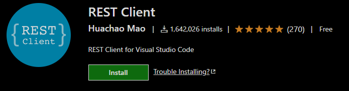

# Express

### Express.js - Library for Routing Web Requests to Handler

Express.js is a JavaScript library that simplifies the process of registering endpoints with the web server so that the requests from your JavaScript code on the client are routed to the correct code within the Web API. 

#### Basic Web Server

```text
const express = require('express');

const app = express();

app.get('/', (req, res)=> {
  res.send('Hello World!');

  // req: HTTP request:
  // URL parameters, query string, data in 
  // request body

  // res: HTTP response: what you send back to the client
  // JSON data, render a template, redirect, etc.
})

const port = 3000;
app.listen(port, ()=> {
  console.log(`Server started on port ${port}`)
});
```

#### Testing Web API - VS Code Rest Client Extension

This is a great extension that allows you to execute web APIs within VS Code.



Create a file named server.rest at the top level of your project. A "Send Request" will appear above the GET command. Click it to execute the request and an output window will show the results.

#### Install JSON Viewer




```javascript
GET http://localhost:3000

###
```

#### install nodemon

nodemon auto-detects changes to the source files in the project and automatically restarts the server. Use the "-D" option to install it as a dev dependency, so it won't be included in the production modules.

```text
npm i -D nodemon
```

```text
{
  "name": "test-npm",
  "version": "1.0.0",
  "description": "",
  "main": "index.js",
  "scripts": {
    "test": "echo \"Error: no test specified\" && exit 1"
  },
  "author": "",
  "license": "ISC",
  "dependencies": {
    "express": "^4.17.1"
  },
  "devDependencies": {
    "nodemon": "^2.0.7"
  }
}
```

### Create a script to launch server in package.json

Now, when we enter the command "npm run dev" it will launch server.js with nodemon.

```text
"scripts": {
  "start": "node server",
  "dev": "nodemon server"
 },
```

And when we modify the source code, we just need to refresh the web browser instead of restarting the node server.

#### Static Files - public folder

Create a folder named public at the top-level of your project and express will automatically serve requests for static files in that folder. HTML and CSS are examples of files that would go here.

```javascript
const path = require('path');

app.use(express.static(path.join(__dirname, 'public')));

```


### Express Basic Request Handling

Create a folder named data and add a new file named zoo.js with the following data.

```javascript
module.exports = {
  caretakers: [
    {
      id: 1,
      firstName: "Nigel",
      lastName: "Nelson",
      imageURL: "https://images.unsplash.com/photo-1600180758890-6b94519a8ba6?ixid=MnwxMjA3fDB8MHxzZWFyY2h8MTYyfHxwcm9maWxlJTIwcGhvdG98ZW58MHx8MHx8&ixlib=rb-1.2.1&auto=format&fit=crop&w=400&q=60",
    },
    {
      id: 2,
      firstName: "Burl",
      lastName: "Bethea",
      imageURL: "https://images.unsplash.com/photo-1590031905406-f18a426d772d?ixid=MnwxMjA3fDB8MHxzZWFyY2h8MjAyfHxwcm9maWxlJTIwcGhvdG98ZW58MHx8MHx8&ixlib=rb-1.2.1&auto=format&fit=crop&w=400&q=60",
    }
  ],
  animalTypes: [
    {
      id: 1,
      name: 'lion',
      location: 'NE',
      caretakerId: 1, // Nigel
    },
    {
      id: 2,
      name: 'tiger',
      location: 'NW',
      caretakerId: 2, // Burl
    }
  ],
  animals: [
    {
      id: 1,
      name: "Zena",
      sex: "female",
      imageURL: "https://images.unsplash.com/photo-1571835782488-1793036d8887?ixid=MnwxMjA3fDB8MHxzZWFyY2h8MTI3fHxsaW9ufGVufDB8fDB8fA%3D%3D&ixlib=rb-1.2.1&auto=format&fit=crop&w=400&q=60",
      age: 12,
      showcase: false,
      typeId: 1, // lion
    },
    {
      id: 2,
      name: "Maxwell",
      sex: "male",
      imageURL: "https://images.unsplash.com/photo-1554990772-0bea55d510d5?ixid=MnwxMjA3fDB8MHxzZWFyY2h8NHx8bGlvbnN8ZW58MHx8MHx8&ixlib=rb-1.2.1&auto=format&fit=crop&w=400&q=60",
       age: 15,
      showcase: false,
      typeId: 1, // lion
    },
    {
      id: 3,
      name: "Faustino",
      sex: "male",
      age:14,
      showcase: true,
      typeId: 1, // lion
      imageURL: "https://images.unsplash.com/photo-1580043621114-172a136b02fa?ixid=MnwxMjA3fDB8MHxzZWFyY2h8MTE0fHxsaW9ufGVufDB8fDB8fA%3D%3D&ixlib=rb-1.2.1&auto=format&fit=crop&w=400&q=60",          age: 7,
    },
    {
      id: 14,
      name: "Neville",
      sex: "male",
      imageURL: "https://images.unsplash.com/photo-1599236449650-f2a86b592422?ixid=MnwxMjA3fDB8MHxzZWFyY2h8M3x8b3R0ZXJ8ZW58MHx8MHx8&ixlib=rb-1.2.1&auto=format&fit=crop&w=400&q=60",
      age: 9,
      showcase: false,
      typeId: 5, // otter
    },
    {
      id: 15,
      name: "Lloyd",
      sex: "male",
      imageURL: "https://images.unsplash.com/photo-1589860170912-6b83cf6f8809?ixid=MnwxMjA3fDB8MHxzZWFyY2h8MXx8b3R0ZXJ8ZW58MHx8MHx8&ixlib=rb-1.2.1&auto=format&fit=crop&w=400&q=60",
      age: 8,
      showcase: false,
      typeId: 5, // otter
    },
    {
      id: 18,
      name: "Cathey",
      sex: "female",
      imageURL: "https://images.unsplash.com/photo-1559253664-ca249d4608c6?ixid=MnwxMjA3fDB8MHxzZWFyY2h8MXx8ZnJvZ3xlbnwwfHwwfHw%3D&ixlib=rb-1.2.1&auto=format&fit=crop&w=400&q=60",
      age: 3,
      showcase: false,
      typeId: 6, // frog
    },
    {
      id: 19,
      name: "Annice",
      sex: "female",
      imageURL: "https://images.unsplash.com/photo-1551189014-fe516aed0e9e?ixid=MnwxMjA3fDB8MHxzZWFyY2h8M3x8ZnJvZ3N8ZW58MHx8MHx8&ixlib=rb-1.2.1&auto=format&fit=crop&w=400&q=60",
       age: 2,
       showcase: false,
      typeId: 6, // frog
    },
    {
      id: 21,
      name: "Bill",
      sex: "male",
      imageURL: "https://images.unsplash.com/photo-1585095595205-e68428a9e205?ixid=MnwxMjA3fDB8MHxzZWFyY2h8N3x8c25ha2V8ZW58MHx8MHx8&ixlib=rb-1.2.1&auto=format&fit=crop&w=400&q=60",
      age: 6,
      showcase: false,
      typeId: 7, // snake
    },
    {
      id: 22,
      name: "Ilana",
      sex: "female",
      imageURL: "https://images.unsplash.com/photo-1557178985-891ca9b9b01c?ixid=MnwxMjA3fDB8MHxzZWFyY2h8OXx8ZWxlcGhhbnR8ZW58MHx8MHx8&ixlib=rb-1.2.1&auto=format&fit=crop&w=400&q=60",
      age: 11,
      showcase: false,
      typeId: 8, // elephant
    },
    {
      id: 25,
      name: "Jefferson",
      sex: "male",
      imageURL: "https://images.unsplash.com/photo-1614698561633-5eb087077543?ixid=MnwxMjA3fDB8MHxzZWFyY2h8Mjl8fGVsZXBoYW50fGVufDB8fDB8fA%3D%3D&ixlib=rb-1.2.1&auto=format&fit=crop&w=400&q=60",
      age: 2,
      showcase: false,
      typeId: 8, // elephant
    },
    {
      id: 28,
      name: "Vicky",
      sex: "female",
      imageURL: "https://images.unsplash.com/photo-1538127426967-75a6c73f6d20?ixid=MnwxMjA3fDB8MHxzZWFyY2h8Nnx8Z2lyYWZmZXxlbnwwfHwwfHw%3D&ixlib=rb-1.2.1&auto=format&fit=crop&w=400&q=60",
      age: 12,
      showcase: false,
      typeId: 9, // giraffe
    },
    {
      id: 29,
      name: "Clay",
      sex: "male",
      imageURL: "https://images.unsplash.com/photo-1536626733238-1bb1f7782c87?ixid=MnwxMjA3fDB8MHxzZWFyY2h8MTN8fGdpcmFmZmV8ZW58MHx8MHx8&ixlib=rb-1.2.1&auto=format&fit=crop&w=400&q=60",
      age: 4,
      showcase: false,
      typeId: 9, // giraffe
    }
  ]
};

```

```javascript
// GET all
app.get('/api/animals', (req, res)=>{
  res.json(zoo.animals);
});

// GET single member by id
app.get('/api/animals/:id', (req, res)=>{
  const id = parseInt(req.params.id);
  const animal = zoo.animals.find(x=>x.id===id);
  res.json(animal);
});
```

#### Express Middleware

```javascript
// middleware will be run every time a
// requests comes in.
const logger = (req, res, next) => {
  // do whatever you want here and then
  // pass the request on to the next middleware
  // in the pipeline
  next();
}

// initialize middleware
app.use(logger);
```

### Express Routes

Express routes allow you to move your handlers into separate files. Create a new directory named "routes" and create a file named "animals.js" within it. Move the following code to the new files.

#### routes/animals.js

```javascript
const express = require('express');
const router = express.Router();
const zoo = require('../data/zoo');

// GET all
router.get('/', (req, res)=>{
    res.json(zoo.animals);
  });

// GET single member by id
router.get('/:id', (req, res)=>{
    const id = parseInt(req.params.id);
    console.log(id);
    const animal = zoo.animals.find(x=>x.id===id);
    if (animal) {
      res.json(animal);
    }
    else {
      res.status(400).json({msg: `no animal with id ${id}`})
    }
  });

module.exports = router;


```

```javascript
const express = require('express');
const path = require('path');

const app = express();

app.use('/api/animals', require('./routes/animals'))

const port = 3000;
app.listen(port, ()=> {
  console.log(`Server started on port ${port}`)
});
```

npm i uuid to generate unique ids

### Resources




