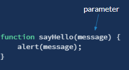

# Function Declarations

A **function** in **JavaScript** is a set of statements that performs a task or calculates a value.

### Declaring Your Own Functions

We've used the alert, confirm, and prompt functions that the JavaScript runtime provides. Now, let's create our own function. There are multiple ways to define a function. We're going to start out with the traditional way it has been done prior to the most recent update to the JavaScript language specification. This particular way is what's known as a **function declaration**.


First, the function keyword is what lets us know that we will be creating a function. The function's name comes next. You can name a function whatever you want, as long as you avoid the special keywords reserved for the language and some other special-cases, such as not starting the name with a number. As long as you try to name your functions with something that makes sense for the action it will be performing, you usually don't run into problems. 

Following the name is a pair of opening and closing parenthesis. These are where you will define any data that your function requires to perform its task. We're going to defer the discussion of passing in data until after we've worked with the simple function that doesn't require any data.

Last is the opening and closing pair of curly braces. These braces surround the statements, or instructions, that the JavaScript engine needs to execute for the function to complete its overall objective. In the simple function above, there is only a single instruction to call the alert function provided by the JavaScript runtime environment.

### Calling Your Functions

Now that we have defined our own function, how do we call it? The same way we called the alert function previously in our script. 

Below, we have declared a function, and then we have a statement that is calling the function.

```javascript
function sayHello() {
    alert('Hello World!');
}

sayHello();
```

#### Function Parameters

As we saw with the JavaScript alert function, functions can accept data, called parameters. In our sayHello function above, we are passing the message "Hello World" as the value for the parameter to the alert function. 

When declaring a function, the parameters are specified as a comma-separated list of parameter names. In our sayHello function below,  we are specifying that the function accepts a single parameter named message. The value of the parameter can then be used in the statements within the function.



Now, instead of always calling the JavaScript alert function with the message "Hello World!", we can use our new sayHello function to allow the caller to specify what the message should be.  This makes our sayHello function much more reusable.

#### Function Return Value

Sometimes the purpose of a function is just to organize a set of instructions, or statements, into a logical group to carry out some task. But other times the purpose of a function is to return data to the caller.

To specify a return value for a function the **return keyword**, followed by the value to return, is used.

The function below calculates the total amount due for a meal that costs $20 and will use a 15% tip rate.

```javascript
function calculateTotalWithTip(amount, rate) {
    let total = amount + (amount * rate);
    return total;
}

let total = calculateTotalWithTip(20, .15);
alert(total);
```

While it's typically the case, the return keyword doesn't have to be the last statement in the function. There are cases where a condition warrants returning from the function earlier. When the JavaScript engine encounters the return keyword, it will immediately return from function, and any statements following the return keyword will not be executed.

```csharp
function calculateTotalWithTip(amount, rate) {
    if (rate = 0) {
        return amount;
    }
    
    let total = amount + (amount * rate);
    return total;
}

let total = calculateTotalWithTip(20, .15);
alert(total);
```

### Default Values for Parameters

Function parameters can have default values. If the caller of the function does not provide a value for a parameter, the default will be used instead.

```csharp
function sayHello(message = "Hello") {
    alert(message);
}

sayHello(); // Hello
sayHello("Hi"); // Hi
```

### Function Declaration Hoisting

Hoisting is a special term in JavaScript regarding how the JavaScript engine processes the functions and variables it encounters as it reads your script line by line. Function declarations, which is what we are using here, are hoisted to the top of the script in terms of whether the function is recognized by the engine when a statement calling the function is encountered. This means that you can call a function before it has been declared because the JavaScript engine will hoist it to the beginning of the script as if that is where you had declared it and so it is as if you declared it before it is called.

In the example below, the add function is called before it has been declared, but the add function is recognized by the JavaScript engine when it is called because the add function is hoisted to the top of the script before execution of the script begins.

```csharp
let total = add(3 + 4);

function add(num1, num2) {
    return num1 + num2;
}
```

The script looks like this in terms of how the JavaScript engine has processed it.

```csharp
function add(num1, num2) {
    return num1 + num2;
}

let total = add(3 + 4);
```


This is an example of one of JavaScript's quirks. While you can call a function before it is declared, it is best practice to declare your functions prior to calling them and there is really no reason why you would need to do otherwise.


